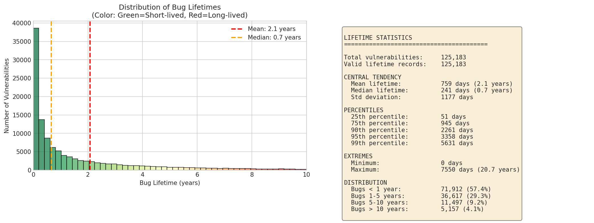
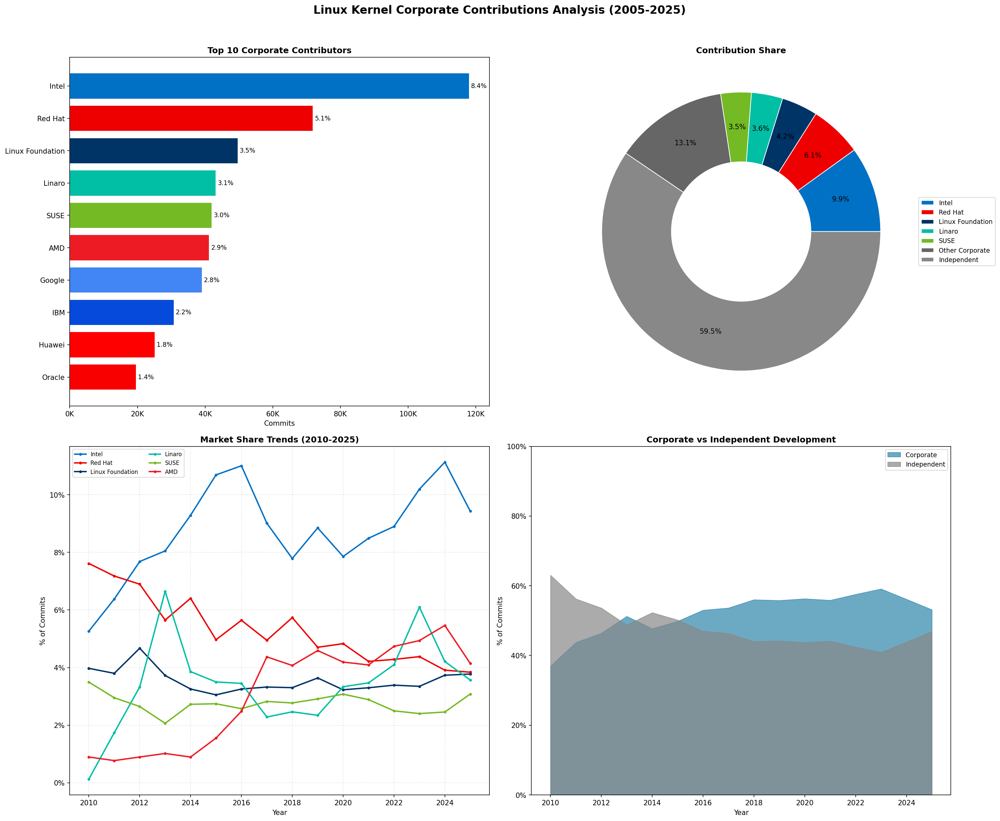

# Linux Kernel Archaeology

**20 years of kernel security bugs and contributions, analyzed.**

This repository contains reproducible analysis of 125,000+ Linux kernel bug-fix pairs spanning 2005-2025, plus analysis of 1M+ total commits to understand corporate contributions to the kernel.

## Key Findings

| Finding | Insight |
|---------|---------|
| **2.1 years** | Median time a security bug survives before being fixed |
| **117 super-reviewers** | Developers who catch bugs 47% faster than average |
| **5x longer** | Race conditions survive vs. other bug types |
| **45% longer** | Bug lifetime for weekend commits |
| **20+ years** | Longest-surviving bugs in our dataset |



## Corporate Contributions

We analyzed all kernel commits to understand who contributes to Linux development:



## Repository Structure

```
kernel-archaeology/
├── README.md
├── CITATION.cff              # Academic citation info
├── LICENSE                   # MIT (code) + CC-BY-4.0 (data/figures)
├── requirements.txt
│
├── figures/                  # All visualizations
│   ├── 01-18_*.png          # Vulnerability analysis plots
│   ├── corporate_*.png      # Corporate contribution plots
│   └── vuln_rate_*.png      # Rate analysis plots
│
├── scripts/                  # Analysis scripts
│   ├── analyze_vuln_db.py           # Parse and analyze vulnerability database
│   ├── analyze_vuln_deep.py         # Deep analysis of vulnerability patterns
│   ├── analyze_vuln_rate.py         # Rate-based vulnerability analysis
│   ├── cluster_vuln.py              # Cluster vulnerabilities by features
│   ├── visualize_rate.py            # Visualize rate analysis results
│   ├── mine_total_commits.sh        # Extract commits from git history
│   ├── corporate_contributions_full.py  # Analyze corporate contributions
│   └── visualize_corporate.py       # Visualize corporate analysis
│
├── methodology/              # Research methodology documentation
│   ├── ANALYSIS_CHOICES.md  # Why we made specific analytical decisions
│   ├── DATA_CONSTRUCTION.md # How the dataset was built
│   ├── LIMITATIONS.md       # Honest assessment of limitations
│   └── RATES_VS_COUNTS.md   # When to use rates vs raw counts
│
├── notebooks/                # Interactive analysis
│   └── 01_data_exploration.ipynb
│
└── data/                     # Dataset documentation (data hosted on HuggingFace)
```

## Quick Start

```bash
# Clone and setup
git clone https://github.com/quguanni/kernel-archaeology.git
cd kernel-archaeology
pip install -r requirements.txt
```

### Vulnerability Analysis

```bash
# Analyze vulnerability patterns
python scripts/analyze_vuln_db.py --data /path/to/vuln_commits_full.csv
python scripts/analyze_vuln_deep.py --data /path/to/vuln_commits_full.csv
```

### Corporate Contributions Analysis

```bash
# Step 1: Extract all commits from kernel git repo
cd /path/to/linux
git log --format="%H|%ae|%ai|%s" --since="2005-01-01" > ~/all_commits.csv

# Step 2: Analyze corporate contributions
python scripts/corporate_contributions_full.py --data ~/all_commits.csv \
    --output corporate_results.csv --yearly corporate_yearly.csv

# Step 3: Generate visualizations
python scripts/visualize_corporate.py --results corporate_results.csv \
    --yearly corporate_yearly.csv --output-dir figures/
```

## Figures

### Vulnerability Analysis (01-18)

| Figure | Description |
|--------|-------------|
| `01_lifetime_distribution.png` | Distribution of bug survival times |
| `02_yearly_trends.png` | Bug introduction and fix rates over time |
| `03_subsystem_analysis.png` | Vulnerability patterns by kernel subsystem |
| `04_bug_type_analysis.png` | Lifetime comparison across bug types |
| `05_author_analysis.png` | Who introduces vs. who fixes bugs |
| `06_temporal_patterns.png` | Day-of-week and seasonal effects |
| `07_severity_analysis.png` | Bug severity distribution |
| `08_feature_clusters_tsne.png` | t-SNE visualization of bug features |
| `09_feature_clusters_umap.png` | UMAP visualization of bug features |
| `10_semantic_clusters_tsne.png` | Semantic clustering of commit messages |
| `11_semantic_clusters_umap.png` | UMAP semantic clustering |
| `12_cluster_deep_dive.png` | Detailed cluster analysis |
| `13_reviewer_network.png` | Reviewer collaboration network |
| `14_super_reviewers.png` | Super-reviewer identification and impact |
| `15_commit_message_quality.png` | Commit message quality analysis |
| `16_subsystem_specific.png` | Per-subsystem deep dive |
| `17_temporal_deployment.png` | Deployment timing patterns |
| `18_recommendations.png` | Actionable recommendations |

### Corporate Contributions

| Figure | Description |
|--------|-------------|
| `corporate_top_companies.png` | Top 15 companies by commit count |
| `corporate_pie_chart.png` | Contribution share by organization |
| `corporate_yearly_stacked.png` | Contributions over time (stacked area) |
| `corporate_market_share.png` | Company market share trends |
| `corporate_vs_independent.png` | Corporate vs independent contributions |
| `corporate_dashboard.png` | Summary dashboard |

### Rate Analysis

| Figure | Description |
|--------|-------------|
| `vuln_rate_analysis.png` | Vulnerability rates over time |
| `vuln_rate_weekend.png` | Weekend vs weekday vulnerability rates |

## Methodology

See the `methodology/` folder for detailed documentation:

- **[ANALYSIS_CHOICES.md](methodology/ANALYSIS_CHOICES.md)** - Why we chose specific thresholds and methods
- **[DATA_CONSTRUCTION.md](methodology/DATA_CONSTRUCTION.md)** - How the 125K bug-fix dataset was built
- **[LIMITATIONS.md](methodology/LIMITATIONS.md)** - Honest assessment of what this analysis doesn't capture
- **[RATES_VS_COUNTS.md](methodology/RATES_VS_COUNTS.md)** - Framework for deciding when to use rates vs raw counts

## Dataset

The vulnerability dataset is available on HuggingFace: [quguanni/linux-kernel-bugfix-pairs](https://huggingface.co/datasets/quguanni/linux-kernel-bugfix-pairs)

**Schema:**
- `fixing_commit` / `introducing_commit`: Commit hashes
- `lifetime_days`: Days between bug introduction and fix
- `subsystem`: Kernel subsystem (net, fs, drivers, etc.)
- `bug_type`: Classification (race, UAF, overflow, etc.)
- `fix_author` / `intro_author`: Who wrote each commit
- `severity_hint`: Estimated severity

## Citation

```bibtex
@misc{qu2025kernelarch,
  author = {Qu, Jenny Guanni},
  title = {Linux Kernel Archaeology: 20 Years of Security Bug Analysis},
  year = {2025},
  publisher = {GitHub},
  url = {https://github.com/quguanni/kernel-archaeology}
}
```

## License

- Code: MIT
- Dataset: CC-BY-4.0
- Figures: CC-BY-4.0

## Contact

Jenny Guanni Qu - jenny@pebblebed.com

Built at [Pebblebed Ventures](https://pebblebed.com).
